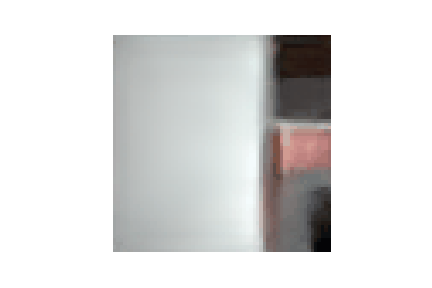

# QueryNetworks
Generative Query Networks, handling both static and dynamic scenes

Codes in this repository implements the Generative Query Network (GQN), which is mentioned in the original paper (doi:10.1126/science.aar6170).

I added to the their idea the ability to query a dynamic/animated object with static background removed. This is still an ongoing work.

GQN trained in a photorealistic environment, being queried in a circular fasion:

